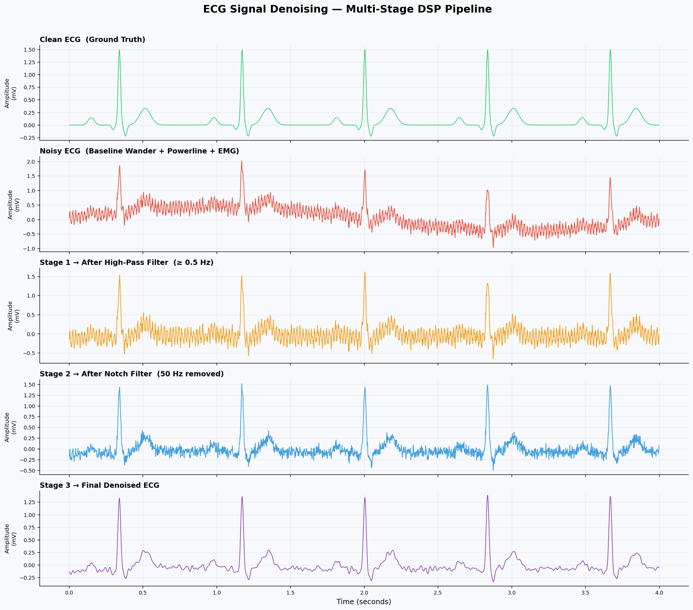
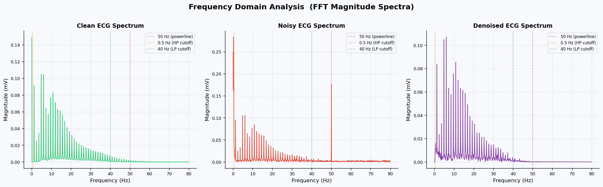

# 🫀 ECG Signal Denoising System

A high-performance digital signal processing (DSP) multi-stage digital filtering system designed to suppress clinical noise artifacts from Electrocardiogram (ECG) recordings. Developed as a 2nd-year Electrical Engineering project at NSUT, applying core theoretical foundations from Alan V. Oppenheim’s *Signals and Systems*.


---

## 1. Project Overview

Electrocardiogram (ECG) signals capture vital biopotential variations generated by the electrical activity of the myocardium. In real-world hospital environments, raw ECG acquisitions are inherently corrupted by physiological and environmental interference. These disturbances obscure critical diagnostic morphological features—specifically the P-wave, T-wave, and the sharp transitions of the QRS complex.

This project implements an end-to-end digital signal processing pipeline that simulates a clean synthetic ECG trace (using a mathematical PQRST waveform model), corrupts it with three realistic clinical noise sources, and systematically recovers the clean signal using a cascaded digital filter topology. 

### Key Engineering Specifications:
* **Sampling Rate ($f_s$):** 500 Hz. This oversamples the primary diagnostic components of the ECG, comfortably satisfying the Nyquist-Shannon criteria while providing exceptional temporal resolution to capture the sharp R-peaks without aliasing.
* **Algorithmic Integrity:** Prioritizes absolute morphological preservation over raw aggressive filtering, leveraging zero-phase filtering techniques critical for diagnostic accuracy.

---

## 2. The DSP Pipeline Architecture

The denoising system processes the corrupted signal sequentially through a three-stage cascaded filter pipeline. The ordering of the stages is deliberate, addressing noise components from lowest frequency to highest frequency to protect the underlying signal from cascading distortion.

```text
  Noisy ECG Signal (-3.27 dB)
              │
              ▼
  ┌──────────────────────────────────────┐
  │ Stage 1: High-Pass Butterworth Filter│ ──► Removes low-frequency breathing drift
  └──────────────────────────────────────┘
              │
              ▼
  ┌──────────────────────────────────────┐
  │  Stage 2: Digital IIR Notch Filter   │ ──► Surgically cuts 50 Hz powergrid hum
  └──────────────────────────────────────┘
              │
              ▼
  ┌──────────────────────────────────────┐
  │  Stage 3: Low-Pass Butterworth Filter│ ──► Suppresses high-frequency muscle noise
  └──────────────────────────────────────┘
              │
              ▼
  Cleaned Diagnostic ECG (+8.21 dB)
```

### Stage 1: High-Pass Butterworth Filter
* **Cutoff Frequency ($f_c$):** 0.5 Hz
* **Filter Order ($N$):** 2nd Order
* **Target Artifact:** Baseline Wander (~0.25 Hz). This slow, non-stationary baseline drift is caused by patient respiration, electrode-skin impedance variations, or physical movement. A high-pass Butterworth filter provides a maximally flat response in the passband, ensuring no low-frequency distortion of the S-T segment.

### Stage 2: Digital IIR Notch Filter
* **Center Frequency ($f_0$):** 50 Hz
* **Quality Factor ($Q$):** 35
* **Target Artifact:** Powerline Interference (50 Hz). Sourced directly from India's electrical grid, this narrow-band sinusoidal hum strongly couples into patient leads. A high-$Q$ infinite impulse response (IIR) notch filter applies surgical attenuation at exactly 50 Hz with a very narrow bandwidth, preserving adjacent high-frequency ECG harmonics.

### Stage 3: Low-Pass Butterworth Filter
* **Cutoff Frequency ($f_c$):** 40 Hz
* **Filter Order ($N$):** 4th Order
* **Target Artifact:** Electromyographic (EMG) Noise. High-frequency wideband random Gaussian noise generated by voluntary/involuntary skeletal muscle contractions. A 4th-order low-pass filter suppresses this out-of-band noise, cleaning the visual trace for clinical inspection.

---

## 3. Mathematical Background & Signal Theory

### Signal-to-Noise Ratio (SNR)
To quantitatively evaluate pipeline efficiency, the Signal-to-Noise Ratio is computed before and after processing. SNR represents the log-transformed ratio of clean signal power to the power of the residual noise, expressed in decibels (dB):

$$SNR_{dB} = 10 \log_{10} \left( \frac{P_{signal}}{P_{noise}} \right) = 10 \log_{10} \left( \frac{\sum_{n=1}^{M} x^2[n]}{\sum_{n=1}^{M} (y[n] - x[n])^2} \right)$$

Where $x[n]$ is the original clean synthetic ECG signal, and $y[n]$ is the signal under evaluation (either noisy input or denoised output).

### Discrete Fourier Analysis (FFT)
The system applies the Fast Fourier Transform (FFT) to transition signals into the discrete frequency domain:

$$X[k] = \sum_{n=0}^{N-1} x[n] \cdot e^{-j \frac{2\pi}{N} kn}$$

By evaluating the magnitude spectrum $|X[k]|$, we map the precise frequency footprints of the noise fields—such as the discrete spectral spike at 50 Hz—and verify that our filter transfer functions $H(z)$ match the targeted stopbands.

### Medical Criticality of Zero-Phase Filtering
Standard causal digital filters introduce frequency-dependent phase shifts, causing an uneven time delay across different frequencies. In cardiac diagnostics, this is unacceptable: artificial delays distort critical temporal intervals such as the **P-R interval**, **QRS complex duration**, and **S-T segment elevation**, potentially mimicking or hiding a myocardial infarction.

To eliminate phase distortion, this pipeline utilizes bidirectional filtering via `scipy.signal.filtfilt`. 

1. **Forward Pass:** The input sequence is filtered by the transfer function $H(z)$, introducing a phase shift $\theta(\omega)$.
2. **Time Reversal:** The intermediate filtered sequence is reversed in time.
3. **Backward Pass:** The time-reversed sequence is passed through the exact same filter $H(z)$, introducing an identical phase shift $\theta(\omega)$.
4. **Final Time Reversal:** The output is reversed again to restore chronological order.

Mathematically, the total filter operation scales the magnitude by $|H(e^{j\omega})|^2$, while the net phase shift cancels out completely: 

$$\Theta_{net}(\omega) = \theta(\omega) + (-\theta(\omega)) = 0$$

---

## 4. Visualizing the Results

### Time-Domain Signal Transition
The multi-stage decomposition below illustrates the sequential cleanup of the raw corrupted signal as it traverses through the high-pass, notch, and low-pass filter cascades:



### Frequency-Domain FFT Comparison
The frequency spectrum explicitly highlights the surgical eradication of the 50 Hz powerline hum alongside the broadband attenuation of high-frequency muscle artifacts:



### Quantitative Performance Metrics

| Pipeline Stage | Signal-to-Noise Ratio (SNR) | Status |
| :--- | :---: | :---: |
| **Initial Corrupted ECG** | $-3.27 \text{ dB}$ | Noise Power Outperforms Signal |
| **Final Fully Denoised ECG** | $+8.21 \text{ dB}$ | Signal Power Dominates |
| **Net SNR System Gain** | **$+11.48 \text{ dB}$** | **Successful Optimization** |

---

## 5. Repository Structure

```text
ecg-denoising-dsp/
├── assets/
│   ├── pipeline.png
│   └── spectrum.png
├── .gitignore
├── README.md
├── requirements.txt
├── main.py
├── ecg_generator.py
├── noise_adder.py
├── filters.py
└── visualizer.py
```

---

## 6. Installation & Quick Start Guide

### 1. Clone the Repository
```bash
git clone https://github.com/suyashsrivastava-ee/ecg-denoising-dsp.git
cd ecg-denoising-dsp
```

### 2. Install the dependencies

It is a good idea to use a virtual environment so the project dependencies stay separate from the rest of your system.

    python -m venv venv

On Windows:

    venv\Scripts\activate

On macOS/Linux:

    source venv/bin/activate

Then install the required packages:

    pip install -r requirements.txt

### 3. Run the project

    python main.py

This will generate the synthetic ECG, add the simulated noise sources, apply the denoising pipeline, and save the result plots.

---

## 7. License

Distributed under the MIT License. See full terms below:

```text
MIT License

Copyright (c) 2026

Permission is hereby granted, free of charge, to any person obtaining a copy
of this software and associated documentation files (the "Software"), to deal
in the Software without restriction, including without limitation the rights
to use, copy, modify, merge, publish, distribute, sublicense, and/or sell
copies of the Software, and to permit persons to whom the Software is
furnished to do so, subject to the following conditions:

The above copyright notice and this permission notice shall be included in all
copies or substantial portions of the Software.

THE SOFTWARE IS PROVIDED "AS IS", WITHOUT WARRANTY OF ANY KIND, EXPRESS OR
IMPLIED, INCLUDING BUT NOT LIMITED TO THE WARRANTIES OF MERCHANTABILITY,
FITNESS FOR A PARTICULAR PURPOSE AND NONINFRINGEMENT. IN NO EVENT SHALL THE
AUTHORS OR COPYRIGHT HOLDERS BE LIABLE FOR ANY CLAIM, DAMAGES OR OTHER
LIABILITY, WHETHER IN AN ACTION OF CONTRACT, TORT OR OTHERWISE, ARISING FROM,
OUT OF OR IN CONNECTION WITH THE SOFTWARE OR THE USE OR OTHER DEALINGS IN THE
SOFTWARE.
```